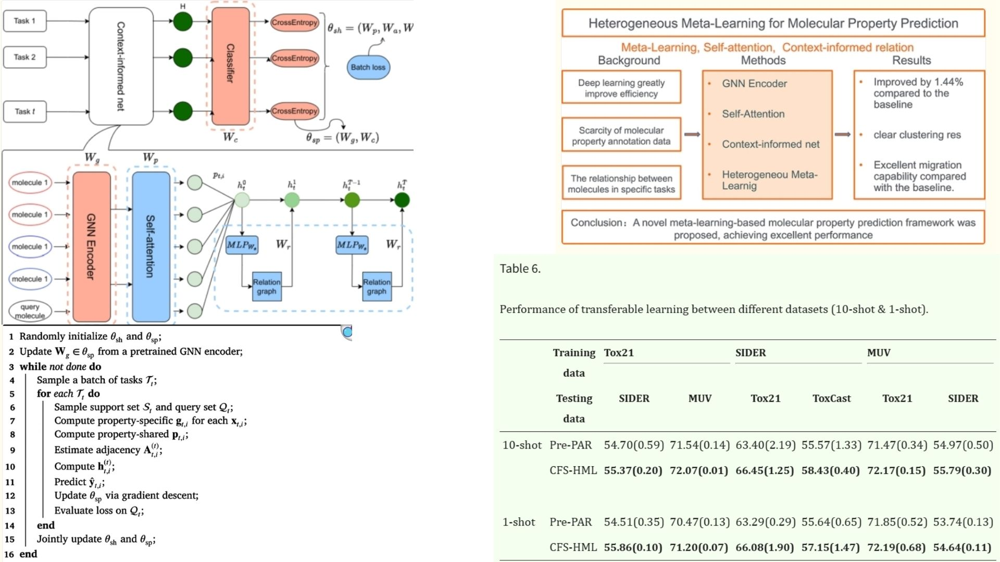

# ✒️ CFMP-MetaLearning-Replication — Context- & Relation-Aware Meta-Molecular Model

This repository provides a **PyTorch replication** of the **CFMP-MetaMol architecture**, reproducing the paper’s **mathematics, block diagrams, and meta-learning structure**.  

It implements **meta-learning over molecular graphs** with **context-informed embeddings** and **relation-aware updates**, using a **single meta_model** to handle both inner- and outer-loop adaptation.  

Focus is on understanding:

- How **atom/bond embeddings** propagate through the GNN encoder 🧩  
- How **KNN graph reduction** and **relation graphs** enhance context representation 🌐  
- How **inner-loop adaptation** quickly updates task-specific embeddings and  
  **outer-loop meta-gradients** optimize generalization across tasks (We didn't replicate the train part,so we didn't put inner and outer loop int this repo) 🔄  

Paper reference: [CFMP-MetaMol: Context- and Relation-Aware Meta-Learning for Molecular Property Prediction](https://pmc.ncbi.nlm.nih.gov/articles/PMC12510055/#se0020)

---

## Overview — Meta-Molecular Learning ✦



> Molecular properties are learned from atom types, positions, and relational context across tasks.

The model integrates:

- **GNN encoder** for atom/bond embeddings  
- **KNN graph reduction** to focus on local neighbors  
- **Relation-aware embedding updates** with self-attention  
- **Prototype-based classifier** for few-shot molecular property prediction  
- **Inner-loop** adaptation for task-specific quick updates  
- **Outer-loop** meta-gradient updates for generalization  

---

## Molecular Representation ⚗︎

A molecule is represented by:

$$
G = (V, E), \quad X = \{x_i\}_{i=1}^N
$$

with atom/bond features projected as:

$$
H^0_i = \text{Encoder}(x_i, G)
$$

---

## Context & Relation Modeling 🌐

- **KNN graph** reduces neighbors to relevant context:  
$$\tilde{G} = \text{KNN}(H^0)$$

- **Relation graph** captures task-aware interactions:  
$$R = f_\text{relation}(\tilde{G})$$

- **Relation-aware embedding update**:  
$$H^{l+1} = H^l + \text{RelationUpdate}(H^l, R)$$

- **Neighbor alignment regularizer** encourages consistent embeddings:
  
$$L_\text{neighbor} = \sum_i \Big\| H_i - \frac{1}{|\mathcal{N}(i)|} \sum_{j \in \mathcal{N}(i)} H_j \Big\|^2$$


---

## Classifier & Prototype ⚡

- Class prototypes computed from support set:  
$$P_c = \frac{1}{|S_c|} \sum_{i \in S_c} H_i$$

- Query molecule classification via distance to prototypes:  
$$\hat{y} = \text{softmax}(-d(H_q, P_c))$$

- Loss includes **CrossEntropy** and **neighbor regularization**:

$$
L = L_\text{CE} + \lambda \, L_\text{neighbor}
$$

---

## Meta-Learning Loops 🔄

- **Inner loop** (task-specific adaptation):

$$
H'_i = H_i - \alpha \, \nabla_{H_i} L_\text{task}(H_i)
$$


- **Outer loop** (meta-gradient update across tasks):
  
$$\theta \;=\; \theta - \beta \cdot \frac{\partial}{\partial \theta} \sum_{\text{tasks}} L_\text{task}(H'_i)$$


> Inner loop adapts embeddings quickly per task, outer loop optimizes the overall model parameters for generalization.

---

## Why CFMP-Metalearning-Replication Matters 🧪

- Handles **few-shot molecular property prediction**  
- Leverages **context-aware GNN embeddings**  
- Integrates **relation graphs and neighbor regularization** for structural bias  
- Minimal, readable implementation for **replication and educational purposes**

---

## Repository Structure 🗂

```bash
CFMP-MetaLearning-Replication/
├── src/
│
│   ├── encoder/
│   │   ├── gnn_encoder.py        # H = Encoder(G)  (embedding)
│   │   └── atom_bond_embed.py    # Atom/bond feature projection
│
│   ├── context_model/
│   │   ├── knn_graph.py          # KNN graph reduction
│   │   ├── relation_graph.py     # Relation graph creation
│   │   ├── relation_update.py    # Relation-aware embedding update
│   │   └── neighbor_reg.py       # Neighbor alignment regularizer loss
│
│   ├── classifier/
│   │   └── classifier.py         # Prototype-based classifier (Eq. 8)
│
│   ├── meta_learning/
│   │   └── meta_model.py         # Full forward: encoder→context→classifier
│
│   └── config.py                 # Paper hyperparameters
│
├── images/
│   └── figmix.jpg                # Model overview figure
│
├── requirements.txt
└── README.md
```
---


## 🔗 Feedback

For questions or feedback, contact: [barkin.adiguzel@gmail.com](mailto:barkin.adiguzel@gmail.com)
